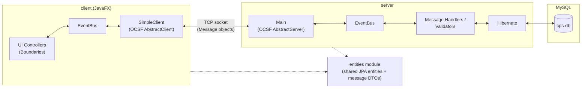

# SmartPark System


A client-server car parking lot management system. Built with **JavaFX** on the client, an **OCSF**-based custom server, and **Hibernate/MySQL** for persistence. Client and server communicate over persistent sockets, with a shared `EventBus` (mediator pattern) decoupling the network layer from the UI/business logic on each side.

## About

SmartPark System digitizes the day-to-day operation of a car parking business: customers can reserve or claim a spot, subscribe to a membership plan, and pay online, while staff manage spots, respond to complaints, and approve pricing changes. The system supports multiple parking lots and models several distinct user roles, each seeing a different view of the same live data:

- **Customers** — enter/exit a lot with or without a prior reservation, sign up as a member, and track their orders, balance, and complaints
- **Parking lot employees** — handle on-site operations such as disabling/enabling spots
- **Customer service employees** — respond to customer complaints
- **Managers** — request price changes and generate reports
- **General managers** — approve or reject price-change requests and review reports across the business

## Architecture

The client and server communicate over persistent TCP sockets (via a custom OCSF layer) rather than request/response HTTP calls, so updates — new orders, complaint responses, price approvals — can be pushed to the relevant clients as they happen. On each side, an `EventBus` decouples the networking code from the UI/business logic that reacts to it, so controllers and handlers never talk to the socket layer directly.



The `entities` module is shared by both sides: it defines the JPA-mapped domain entities (`User`, `Spot`, `Order`, `Complaint`, …) as well as the `Message` DTOs sent back and forth over the socket connection, so client and server always agree on the wire format.

## Features

- **Parking operations** — enter/exit with or without a reservation, standard and full memberships, spot reservations and cancellations
- **Roles** — customer, parking lot employee, customer service employee, manager, and general manager, each with a dedicated dashboard
- **Membership & billing** — sign-up, membership purchase/renewal, balance tracking, and payment flows
- **Requests & approvals** — price-change requests routed from managers to the general manager for approval
- **Complaints** — customers submit complaints; staff track and respond to them
- **Reporting** — orders, complaints, and disabled-spot reports, generated on request and reviewed by management
- **Spot management** — disable/enable individual spots and track their history

## Tech Stack

| Layer | Technology |
|---|---|
| Client UI | JavaFX |
| Client-server transport | Custom OCSF (Object Client-Server Framework) over TCP sockets |
| Event handling | [greenrobot EventBus](https://github.com/greenrobot/EventBus) (mediator pattern) |
| Persistence | Hibernate ORM |
| Database | MySQL |
| Build | Maven (multi-module) |

## Project Structure

| Module | Description |
|---|---|
| [`client/`](client) | JavaFX desktop client. Uses `EventBus` to pass events between the network layer (`SimpleClient`) and UI controllers. |
| [`server/`](server) | OCSF-based server handling client requests, validation, and business logic. |
| [`entities/`](entities) | Shared module: JPA entities and message DTOs used by both client and server. |

## Getting Started

### Prerequisites

- JDK 15+
- Maven
- MySQL server

### Setup

1. Copy the Hibernate config template and fill in your local database credentials:
   ```
   cp server/src/main/resources/hibernate.properties.example server/src/main/resources/hibernate.properties
   ```
   Then edit `hibernate.properties` with your MySQL URL, username, and password. This file is git-ignored — never commit real credentials.

2. Create the database referenced in `hibernate.connection.url` (default: `cps-db`). Hibernate will create the tables automatically (`hibernate.hbm2ddl.auto = create`).

3. Build all modules from the project root:
   ```
   mvn install
   ```

### Running

1. Start the server:
   ```
   cd server
   mvn exec:java
   ```
2. Start the client:
   ```
   cd client
   mvn javafx:run
   ```

### Try it out

The server seeds a few demo accounts on first run, so you can log in immediately without registering:

| Role | ID | Password |
|---|---|---|
| Customer | `208110130` | `102030` |
| Parking lot employee | `111222333` | `111222333` |
| Manager | `111111333` | `111111333` |
| General manager | `999999999` | `999999999` |
| Customer service employee | `111111111` | `111111111` |
